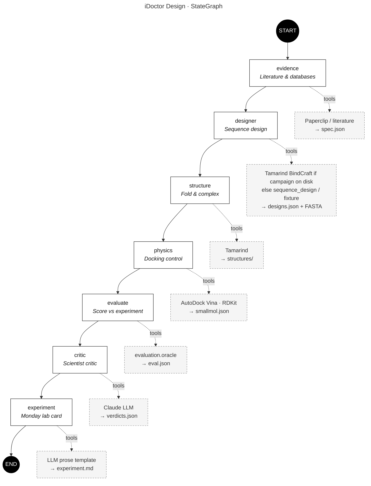
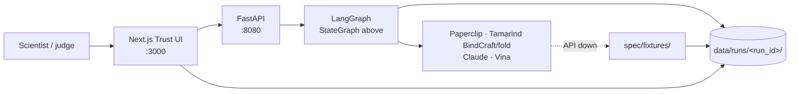

# iDoctor Design

**An AI scientist for sotorasib-resistant KRAS G12C.**

iDoctor Design reads how KRAS G12C drugs fail, designs a new protein/peptide binder under those constraints, tests it against structure and docking controls, and is only allowed to **keep the designs it cannot disprove**. Rejects are part of the product.

Built for [re:AGENT 2026](https://reagent.ai) — **Track A (AI Scientist)**, with artifacts for Track B (resistance atlas) and Track C (new biological sequence).

> Spec is the source of truth: [`spec/`](./spec/README.md) → start with [`PROJECT_BRIEF.md`](./spec/PROJECT_BRIEF.md).

---

## The problem

Cancer cells often carry a broken switch protein called **KRAS**. One common version is **KRAS G12C**. In 2021 the FDA approved **sotorasib (Lumakras)**, the first drug that could stick to that switch and turn it down.

It helps many patients. Then, often within months, the cancer finds a workaround: a **resistance mutation** (for example Y96D) changes the pocket so the drug no longer fits. The patient relapses. That is the central clinical failure mode of this drug class.

Figuring out “what should we make next?” usually means a human reading hundreds of papers, looking at structures, and guessing — or treating a docking score as truth. Both are slow and easy to get wrong.

## What this app does

iDoctor Design does the job a careful computational biologist would do on Monday, and shows its work:

1. **Read the record** — papers, clinical trials, drug databases, and PDB structures for how sotorasib fails
2. **Write a spec** — structured mutations, pocket residues, failed small molecules, and success criteria (`spec.json`)
3. **Design something new** — a miniprotein/peptide binder for the Switch II region under resistance constraints. **Live BindCraft on Tamarind** (RFdiffusion + ProteinMPNN + AF2 filters) only when a finished campaign is on disk; otherwise a labeled heuristic `sequence_design` or fixtures. Never present those fallbacks as RFdiffusion.
4. **Test on a computer** — fold designs (Tamarind), dock known small molecules as a **control** (AutoDock Vina), compare WT vs mutant
5. **Argue with itself** — promote / hold / reject with citations and metrics (Claude critic)
6. **Propose a Monday experiment** — a one-page wet-lab markdown card (not a chat summary)

**What it is not:** a general biology chatbot, a four-disease docking leaderboard, or a pitch that “beats” an FDA drug from a Vina score alone.

### One-sentence pitch

> iDoctor Design reads how KRAS G12C drugs fail, designs a new binder under those constraints, and keeps only the designs it cannot disprove.

---

## How it works

The backend is a **LangGraph** pipeline. Each node writes contract files into `data/runs/<run_id>/`. The Next.js Trust UI reads that folder (not invented React state) so every promote/reject is inspectable.

### Pipeline (step by step)

| Step | Agent (UI label) | What it produces |
|------|------------------|------------------|
| 1 | **Literature & databases (Paperclip)** | Resistance mutations + citations → `spec.json` |
| 2 | **Sequence design (BindCraft)** | Candidate binders → `designs.json` + FASTA |
| 3 | **Fold & complex (Tamarind)** | Structure metrics (pLDDT / ipTM) → `structures/` |
| 4 | **Docking control (AutoDock Vina)** | Known small mols on WT vs mutant → `smallmol.json` |
| 5 | **Score vs experiment** | Spearman / residuals / disagreements → `eval.json` |
| 6 | **Scientist critic (Claude)** | `promote` / `hold` / `reject` → `verdicts.json` |
| 7 | **Monday lab card** | Wet-lab experiment plan → `experiment.md` |

Edges are strictly linear (same as the Mermaid below): evidence → designer → structure → physics → evaluate → critic → experiment.

Any node may fall back to a **fixture** if a partner API is down, and mark `provenance` accordingly. Downstream nodes still run. The UI shows a demo-data banner when provenance is fixture — do not present fixture sequences as live inventions.

### Run modes

| Mode | Behavior |
|------|----------|
| `live` | Call partner tools when keys/packages are present; otherwise graceful fallbacks |
| `fixture` | Copy `spec/fixtures/` into a new run and exercise critic + UI |
| `replay` | Reuse an existing `data/runs/<id>` with no partner calls |

Without partner keys: Europe PMC + ClinicalTrials.gov, local `sequence_design`, heuristic folds.  
With keys: Paperclip CLI, Tamarind **folds**, Claude critic. **BindCraft (RFdiffusion + ProteinMPNN)** only if `data/bindcraft_designs/designs.json` exists from a finished Tamarind job. `USE_PROTO` is off. Do not claim a diffusion model ran on the heuristic path.

Stage demo default is **`replay`** of a saved run (demo-data banner on).

---

## Architecture

### LangGraph agent graph

Matches `build_idoctor_design_graph()` in [`backend/pipeline.py`](./backend/pipeline.py) — a linear `StateGraph` over `IDoctorDesignState`.



**State** (`IDoctorDesignState`) is threaded through every node: `run_id`, `mode`, `scientific_spec`, `designs`, `smallmol`, `eval_result`, `verdicts`, `experiment_md`, `provenance`, `agent_traces`, …

Any node may load a fixture and set `provenance.nodes[<name>] = "fixture"`; the edge still advances.

### System context



### Code layout

```text
spec/                 Product brief, requirements, contracts, fixtures, runbooks
backend/
  main.py             FastAPI: /api/run, /api/runs/latest, SSE status
  pipeline.py         LangGraph of evidence → … → experiment
  agents/             evidence, designer, structure, physics, evaluator, critic, experiment
  tools/              paperclip, tamarind, sequence_design, literature (proto_runner leftover)
  evaluation/         oracle metrics (Spearman, residuals, WT–mutant delta)
  simulation/         Vina docking + PDB cache
  contracts/          JSON schema validation + Ryan novel_designs adapter
frontend/             Trust UI (mutation map, designs, rejects, eval, experiment card)
design/               leftover Proto CLI — live designer is backend/agents/designer.py
data/runs/            Per-run contract files (gitignored)
data/bindcraft_designs/  Finished BindCraft campaign pickup (gitignored except .gitkeep)
```

### API (minimum)

| Method | Path | Result |
|--------|------|--------|
| `POST` | `/api/run` | Start a run (`live` \| `replay` \| `fixture`) → `{ job_id }` |
| `POST` | `/api/tamarind/validate-job` | Ryan `designspec.py` seam: `{type, settings}` → Tamarind-normalized settings (no submit) |
| `GET` | `/api/run/{id}/status` | SSE / poll agent statuses |
| `GET` | `/api/runs/latest` | Latest run folder as JSON |
| `GET` | `/api/runs/{id}/file/{name}` | Raw contract file |
| `GET` | `/api/protein/{pdb_id}` | PDB fetch for the viewer |

OpenAPI: http://localhost:8080/docs

---

## Quick start

```bash
# Backend
cp backend/.env.example backend/.env   # fill partner keys locally (gitignored)
PYTHONPATH=. uvicorn backend.main:app --host 0.0.0.0 --port 8080

# Frontend (separate terminal)
cd frontend && npm install && npm run build && npm run start -- -H 0.0.0.0 -p 3000
```

- **UI:** http://localhost:3000 — loads the **latest saved run** on boot  
  (`?run=replay` / `?run=live` / `?run=fixture` / `?run=none` to override)
- **API:** http://localhost:8080/docs

### Live pipeline (CLI)

```bash
PYTHONPATH=. python -c "from backend.pipeline import run_idoctor_design; r=run_idoctor_design('live'); print(r['provenance']['nodes'])"
```

Partner keys optional. See [`spec/runbooks/live_mode.md`](./spec/runbooks/live_mode.md).

### Fixture / offline

```bash
PYTHONPATH=. python -c "from backend.pipeline import run_idoctor_design; print(run_idoctor_design('fixture')['verdicts'])"
```

### Partner env keys

See `backend/.env.example`. Optional upgrades:

| Variable | Purpose |
|----------|---------|
| `PAPERCLIP_API_KEY` | Literature / trials / databases |
| `TAMARIND_API_KEY` | Fold/complex jobs, and BindCraft when a campaign is submitted |
| `ANTHROPIC_API_KEY` | Critic + experiment prose |

`IDOCTOR_DESIGN_DEFAULT_MODE` (`fixture` / `live` / `replay`) and `IDOCTOR_DESIGN_LIVE_DESIGN` control default mode. Stage walkthrough: **replay**. Never commit `backend/.env`.

---

## Trust UI (what a judge should see)

A person who did not write the code should answer three questions from the screen in ~90 seconds:

1. **What did the literature force us to optimize for?** Mutation list with paper/trial IDs  
2. **What did we make that did not exist yesterday?** A sequence + why it was allowed to live  
3. **Why should we not trust it?** Reject pile, WT-vs-mutant comparison, novelty / remaining risk  

Panes: mutation map, design table + reject drawer, small-molecule control (Ki next to Vina), eval panel, Monday experiment card.

Acceptance checklist: [`spec/ACCEPTANCE.md`](./spec/ACCEPTANCE.md).

---

## Scientific scope (frozen)

| Choice | Value |
|--------|--------|
| Target | KRAS G12C only (PDB `6OIM` default) |
| Clinical hook | Sotorasib resistance |
| Starting mutations | Y96D, H95D, R68S, Y96C (editable via `spec.json`) |
| What we design | Miniprotein / peptide binder to Switch II |
| What we do not design | A new small-molecule drug from scratch |
| Docking | Control arm only — never the final winner |
| LLM | Claude for critic / experiment; low temperature; no invented Ki or PDB IDs |

---

## Docs map

| Doc | Audience |
|-----|----------|
| [`spec/PROJECT_BRIEF.md`](./spec/PROJECT_BRIEF.md) | Everyone — plain language |
| [`spec/REQUIREMENTS.md`](./spec/REQUIREMENTS.md) | Product + engineering |
| [`spec/ARCHITECTURE.md`](./spec/ARCHITECTURE.md) | Implementers |
| [`spec/DATA_CONTRACTS.md`](./spec/DATA_CONTRACTS.md) | Shared JSON schemas |
| [`spec/ACCEPTANCE.md`](./spec/ACCEPTANCE.md) | Demo / judging |
| [`COORDINATION.md`](./COORDINATION.md) | Live team board (generated from GitHub issues) |
| [`spec/runbooks/`](./spec/runbooks/) | Paperclip, Tamarind, live mode (Proto leftover) |

---

## License

MIT
