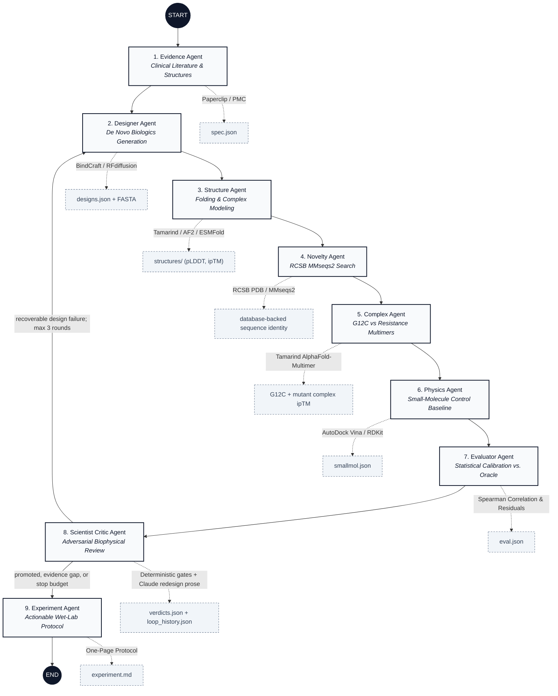
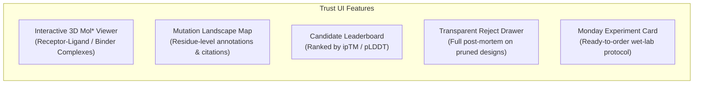

# iDoctor Design 🧬

**An Autonomous Computational Biology Platform for Sotorasib-Resistant KRAS G12C.**

[]()
[](https://opensource.org/licenses/MIT)
[]()
[]()
[]()

---

## Abstract

Acquired resistance to first-generation covalent KRAS G12C inhibitors (such as sotorasib and adagrasib) represents a critical clinical challenge in oncology. Secondary point mutations—notably **Y96D**, **A59S**, **H95D**, and **R68S**—alter the Switch II binding pocket topology, abrogating small-molecule drug affinity.

**iDoctor Design** is an autonomous closed-loop scientific platform that models clinical resistance mechanisms, designs de novo miniprotein/peptide binders to engage mutated Switch II pockets, benchmarks predictions against experimental docking baselines, and applies rigorous **adversarial self-criticism** to reject unviable candidates. Rather than optimizing for raw in silico scores, the system treats **falsification and candidate pruning as primary scientific deliverables**.

---

## 🔬 Molecular Pharmacology & Clinical Problem

```
                        [ KRAS G12C ONCOGENE ]
                                  │
                  Sotorasib / Lumakras (FDA 2021)
                                  │
                                  ▼
                     [ Initial Clinical Response ]
                                  │
                 Acquired Point Mutation (e.g. Y96D)
                                  │
                                  ▼
          ┌─────────────────────────────────────────────────┐
          │  Switch II Pocket Restructuring & Steric Clash  │
          │         Small-Molecule Drug Affinity Drops      │
          │                 Patient Relapses                │
          └─────────────────────────────────────────────────┘
```

1. **The Structural Challenge:** Sotorasib binds covalently to Cys12 in the switch II pocket while making key hydrophobic contacts with Tyr96. When tumor cells mutate Tyr96 to Aspartate (**Y96D**), the negative charge and altered steric volume eliminate binding.
2. **The In Silico Pitfall:** Generative models frequently generate molecules with high predicted docking scores that fail in vitro due to unmodeled conformational flexibility, lack of mutant specificity, or cross-reactivity with wild-type structures.
3. **The Solution:** A closed-loop discovery pipeline that extracts clinical evidence, generates de novo biologics, models 3D complex structures, calibrates docking against experimental controls ($K_i$), and aggressively filters false positives.

---

## 🏗️ System Architecture & Discovery Pipeline

The discovery engine is an inspectable **LangGraph `StateGraph`** with nine agents and a bounded verification loop. In live mode the critic can return structured failure codes to the designer; fixture and replay runs remain linear. SQLite checkpoints make interrupted compute runs resumable by `run_id`.



### Agent Roles & Deliverables

| Stage | Agent Name | Input / Tooling | Scientific Output |
| :--- | :--- | :--- | :--- |
| **1** | **Evidence Agent** | PubMed Central, ClinicalTrials.gov, PDB API, Paperclip CLI | [`spec.json`](./spec/DATA_CONTRACTS.md) — Clinically validated mutation profiles and pocket residue constraints. |
| **2** | **Designer Agent** | BindCraft (RFdiffusion + ProteinMPNN) / Heuristic generator | [`designs.json`](./spec/DATA_CONTRACTS.md) — Candidate miniprotein sequences targeting the mutated Switch II pocket. |
| **3** | **Structure Agent** | Tamarind Bio API (AlphaFold2, ESMFold, Boltz, Chai) | `structures/` — Predicted 3D complexes, per-residue $\text{pLDDT}$, and interface $\text{ipTM}$ scores. |
| **4** | **Novelty Agent** | RCSB PDB Search API / MMseqs2 | Database-backed sequence identity with PDB hit IDs and alignment metadata. |
| **5** | **Complex Agent** | Tamarind AlphaFold-Multimer + IPSAE | Real G12C-versus-resistance complex ipTM panel for the top candidate. |
| **6** | **Physics Control** | AutoDock Vina, OpenMM, PDBFixer, RDKit, Meeko | [`smallmol.json`](./spec/DATA_CONTRACTS.md) — Docking energies ($\text{kcal/mol}$) for known drugs on WT vs. mutant KRAS (`6OIM`). |
| **7** | **Evaluator Agent** | Statistical Oracle (Spearman rank correlation, residual error) | [`eval.json`](./spec/DATA_CONTRACTS.md) — Disagreement matrix between in silico scores and measured $K_i$ values. |
| **8** | **Scientist Critic** | Deterministic gates + Claude prose | [`verdicts.json`](./spec/DATA_CONTRACTS.md) — Classification into `promote`, `hold`, or `reject` with explicit scientific rationale. |
| **9** | **Experiment Agent** | Markdown Protocol Engine | [`experiment.md`](./spec/DATA_CONTRACTS.md) — Complete wet-lab validation card (DNA synthesis, protein expression, SPR/BLI assays). |

---

## 🛡️ Rigorous Falsification & The "Reject Pile"

A core scientific principle of iDoctor Design is **negative selection**. Rather than passing all generative outputs to downstream stages, the system subjects each design to strict pruning filters:

1. **Structural Confidence Filter:** Candidate miniproteins must satisfy the run spec's pLDDT threshold and $\text{ipTM} \ge 0.75$. Heuristic or fixture metrics cannot justify promotion.
2. **Differential Specificity Filter:** Designs that show high affinity for wild-type KRAS but fail to engage the mutant pocket (e.g. `Y96D`) are rejected.
3. **Homology De-duplication:** Novelty must come from a database-backed method such as MMseqs, BLAST, or Foldseek. Generator-estimated identity is held as unverified.
4. **Docking Baseline Calibration:** Known small-molecule controls (Sotorasib, Adagrasib, MRTX1133) are docked against WT and mutants. Disagreements between docking scores and experimental $K_i$ data are factored into the critic's uncertainty model.

All rejected candidates are preserved in [`verdicts.json`](./spec/DATA_CONTRACTS.md) and displayed in the UI Reject Drawer with full diagnostic telemetry.

The loop is deliberately not allowed to grade its own proxy into a success. Sequence-composition mutant scores can prioritize candidates, but promotion requires a trusted WT-versus-mutant complex or experimental evaluation. Every round is archived under `iterations/round-XX/`; the loop stops on promotion, an evidence gap, no improvement, or the iteration budget. Human review is reserved for the wet-lab/clinical boundary, not routine compute-node transitions.

### Verified live run

Run `20260816-152816-578b24` completed all nine stages with live Paperclip/Claude evidence, live design and structure generation, RCSB novelty verification, and a complete Tamarind AlphaFold-Multimer panel. The top candidate scored **ipTM 0.43** on KRAS G12C and **0.19** on both Y96D and H95D, so the critic correctly rejected it (`low_iptm`, `wt_only_signal`) instead of promoting a weak binder. The run artifacts—including three complex PDBs, `complex_scores.json`, `verdicts.json`, `experiment.md`, and `langgraph.sqlite`—are archived under `data/runs/<run_id>/`.

This negative result is an intentional end-to-end proof that the agent can produce, verify, and falsify a candidate without substituting a proxy score for scientific evidence.

---

## 🖥️ Trust UI & Visualization Suite

The web platform ([`frontend/`](./frontend/)) provides computational biologists with full visual transparency into every run:



* **Interactive 3D Viewer:** Built with Mol* / 3Dmol for inspecting predicted binding interfaces and steric clashes.
* **Lineage & Traceability:** Every data point displays its exact execution provenance (`live`, `replay`, or `fixture`).

---

## 🚀 Getting Started

### Prerequisites
* Python 3.11+
* Node.js 18+ and npm
* (Optional) Partner API Keys: `PAPERCLIP_API_KEY`, `TAMARIND_API_KEY`, `ANTHROPIC_API_KEY`

### 1. Backend Service

```bash
# Navigate to project root
cd idoctor

# Configure environment variables (optional for replay/fixture modes)
cp backend/.env.example backend/.env

# Launch FastAPI application server
PYTHONPATH=. uvicorn backend.main:app --host 0.0.0.0 --port 8080 --reload
```

### 2. Frontend Interface

```bash
# In a separate terminal session
cd frontend
npm install
npm run dev
```

* **Web Interface:** [http://localhost:3000](http://localhost:3000)
* **REST API Documentation:** [http://localhost:8080/docs](http://localhost:8080/docs)

### 3. Programmatic Pipeline Execution (CLI)

```python
# Execute the full pipeline in Python
from backend.pipeline import run_idoctor_design

# Options: 'replay' (instant benchmark), 'fixture' (local validation), 'live' (full API calls)
results = run_idoctor_design(mode="replay")
print(f"Pipeline finished with run ID: {results['run_id']}")
print(f"Verdicts: {results['verdicts']['summary']}")
```

---

## 📁 Repository Structure

```text
├── backend/
│   ├── main.py              # FastAPI server (REST endpoints, SSE event streams)
│   ├── pipeline.py          # LangGraph state machine definition
│   ├── agents/              # 7 specialized discovery agents
│   ├── simulation/          # AutoDock Vina runner, PDBFixer receptor prep, RDKit
│   ├── evaluation/          # Oracle metrics (Spearman rank, residuals, WT-mutant delta)
│   ├── tools/               # External tool adapters (Paperclip, Tamarind Bio, BindCraft)
│   └── contracts/           # Pydantic schemas and contract validation
├── frontend/
│   ├── src/app/             # Next.js 15 app router & layout
│   ├── src/components/      # UI components (ProteinViewer, MutationMap, RejectDrawer, etc.)
│   └── src/lib/             # API clients, state management, and type definitions
├── spec/                    # Formal data contracts, requirements, and test fixtures
└── data/runs/               # Immutable artifact outputs per execution run
```

---

## 📄 License & Attribution

This project is licensed under the **MIT License** — see the [LICENSE](LICENSE) file for details.
Developed for research and computational biology discovery workflows.
